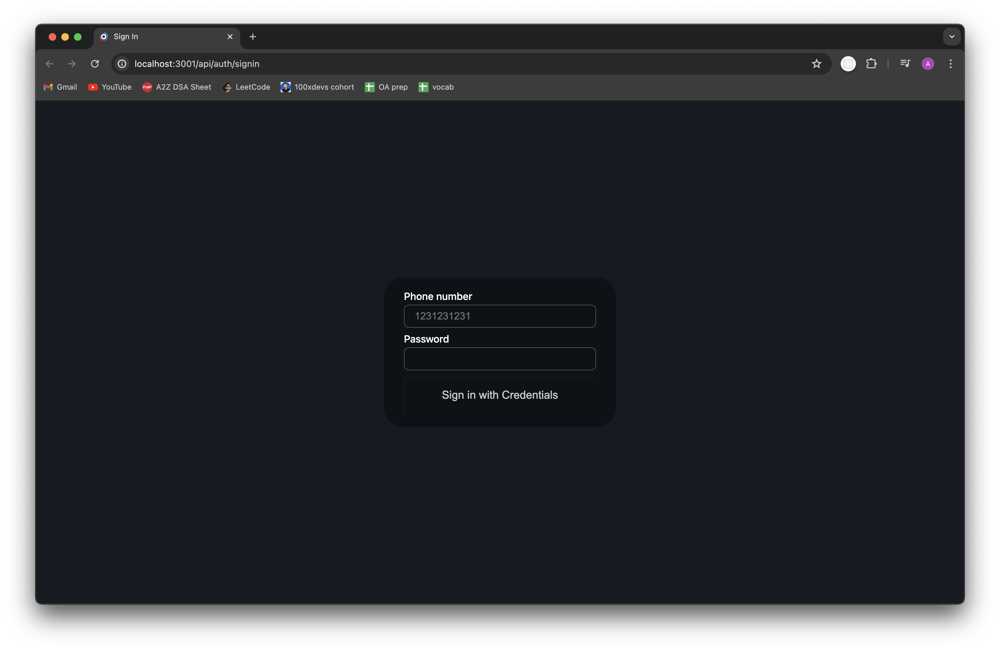
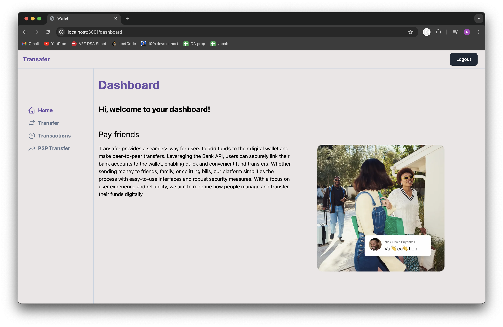
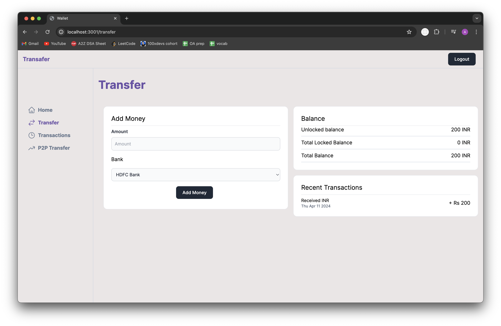
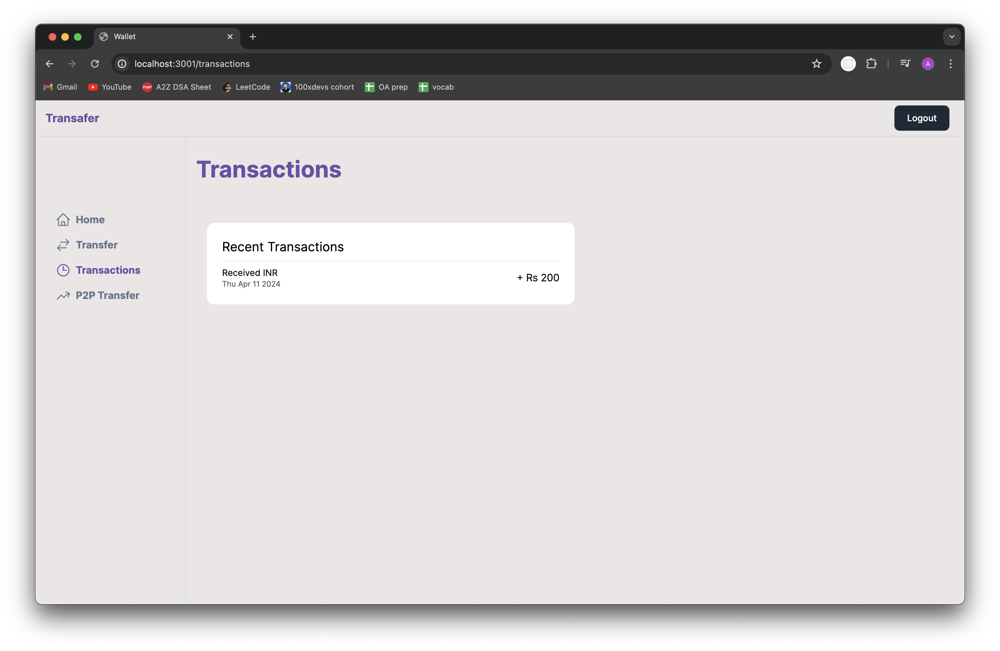
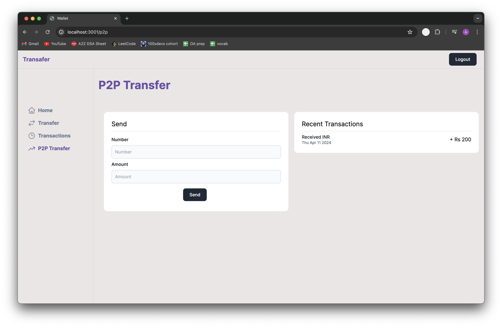

# Transafer: A Digital Wallet Application

Transafer is a modern digital wallet application built with Next.js, Tailwind CSS, and TypeScript. It allows users to sign up, sign in, transfer money to other users, and add money to their wallets. The application integrates with real banks using dummy endpoints created with Express.js. Transafer provides a secure and user-friendly platform for managing finances online.

## Features

### 1. Signup/Signin

- **Description:** Easily create a new account or sign in to your existing account.

### 2. Dashboard

- **Description:** The dashboard provides users with a comprehensive overview of their account, including their current balance, recent transactions, and any pending actions. 

### 3. Transfer

- **Description:** The transfer page allows users to add money to their wallet from different banks. Users can choose the bank from which they want to add money, providing flexibility and convenience.

### 4. Transactions

- **Description:** The transactions page provides users with a detailed list of all their transactions. Users can see the date, time, and amount of each transaction, as well as the status (completed, pending, etc.). 

### 5. P2P Transfer

- **Description:** The P2P transfer feature allows users to transfer money to another person using their mobile number. Users can easily send money to friends, family, or anyone else in their contact list, making payments quick and hassle-free.
