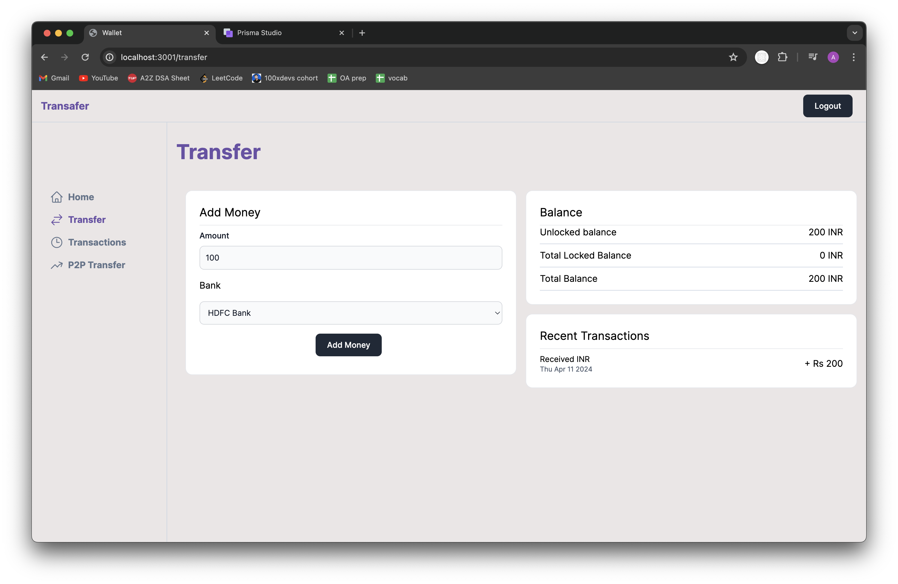
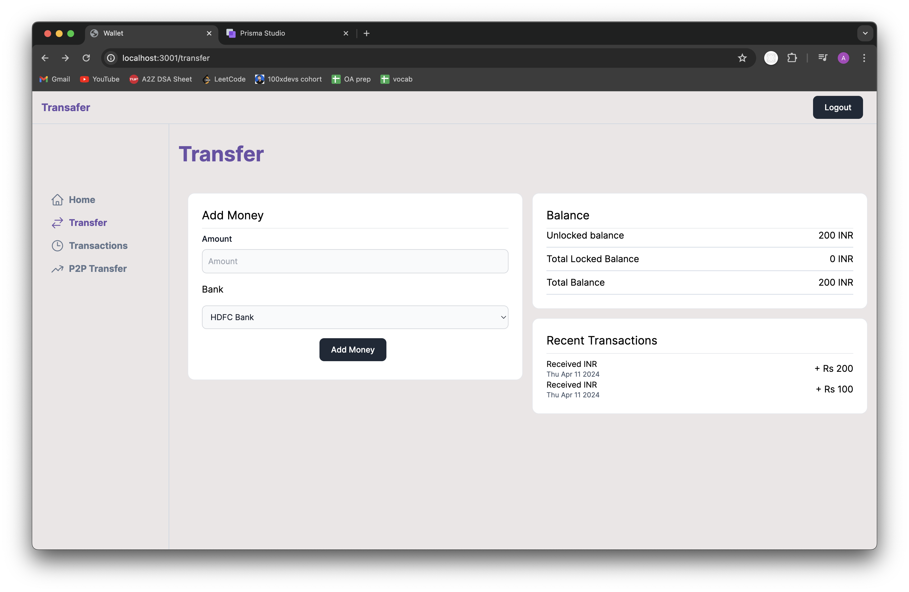
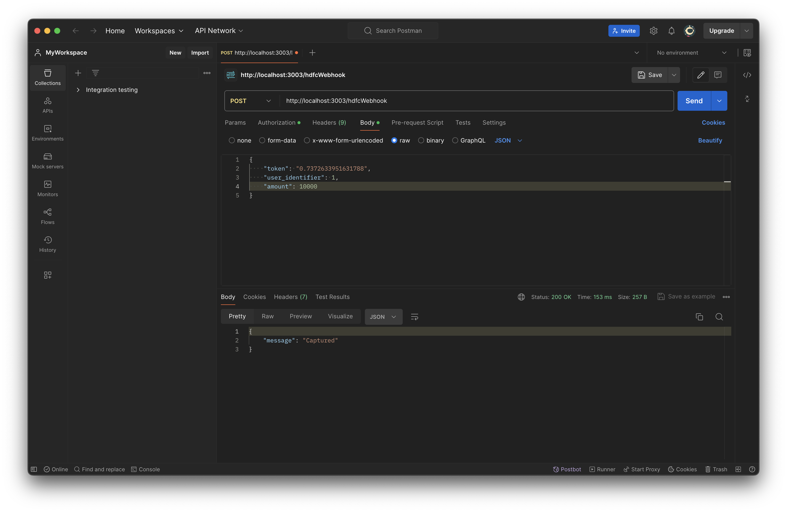
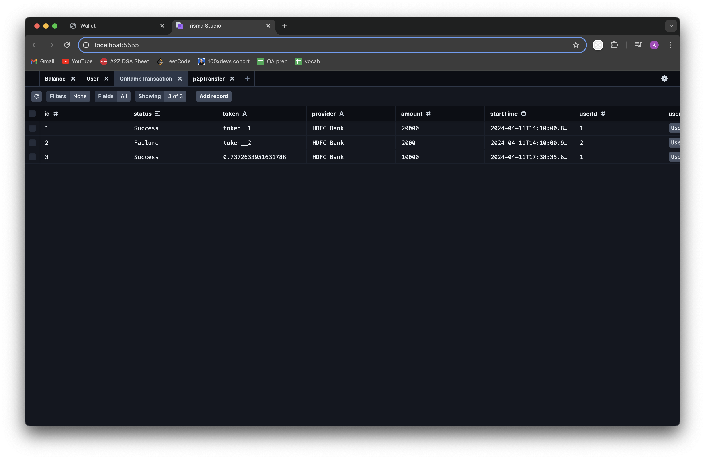

# Working of the dummy endpoints for banks and how money gets added to the wallet

- Adding 100

- HDFC Bank

- Processing 100

- Prisma

- Authorising the request

- Success 100

- Money added to the wallet
