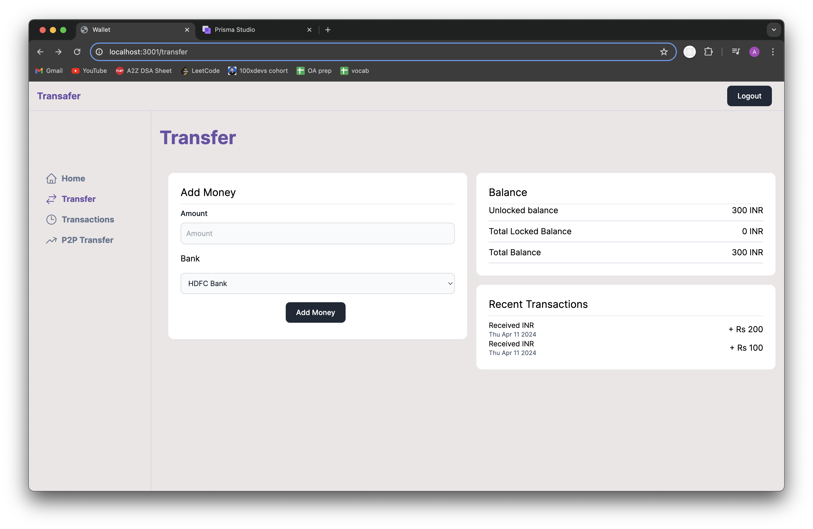

# Working of the dummy endpoints for banks and how money gets added to the wallet

- Adding 100

- HDFC Bank

- 100 did not get added to wallet because the request hasn't been fetched by the bank server

- Processing 100

- Authorising the request

- Success 100

- Money added to the wallet
